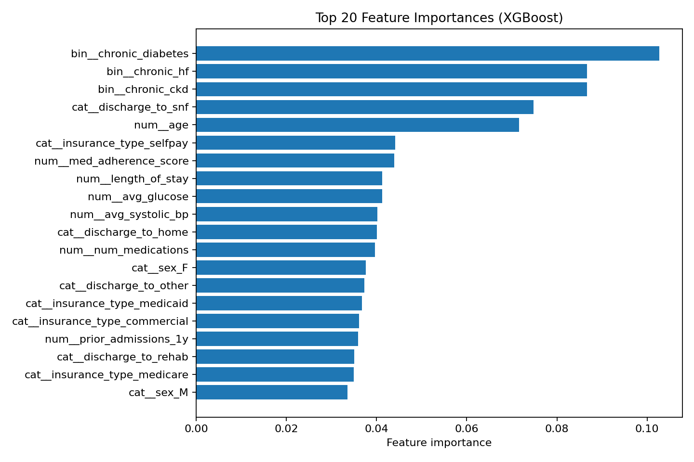
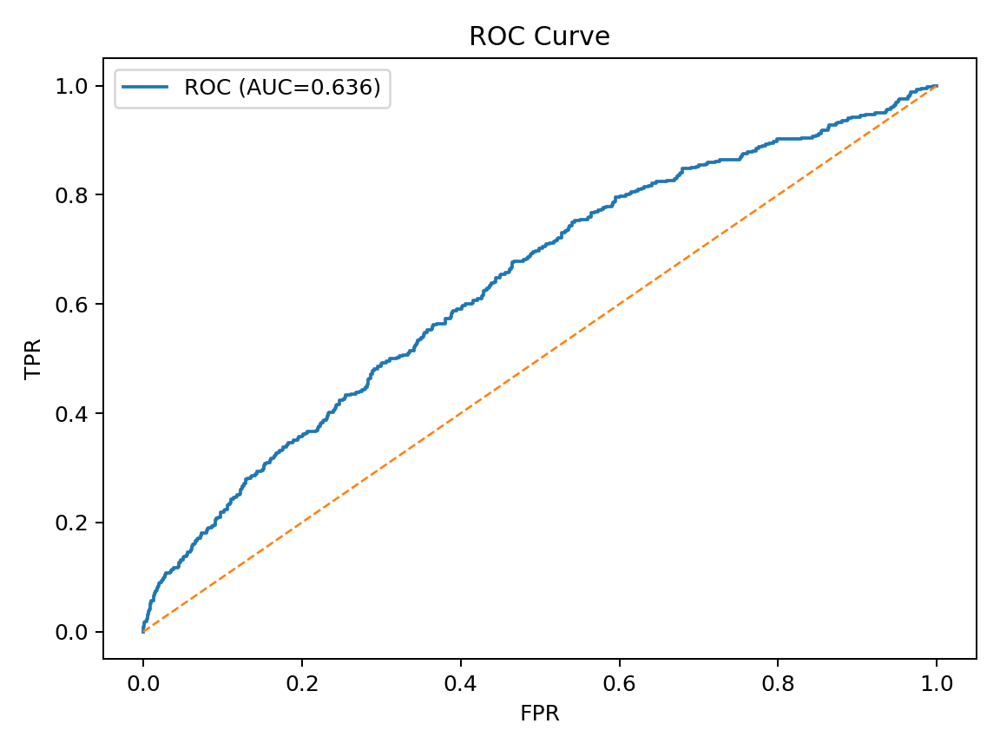
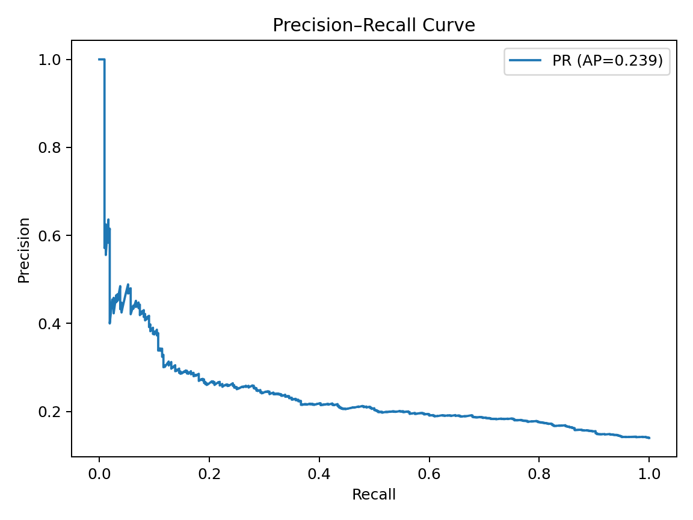
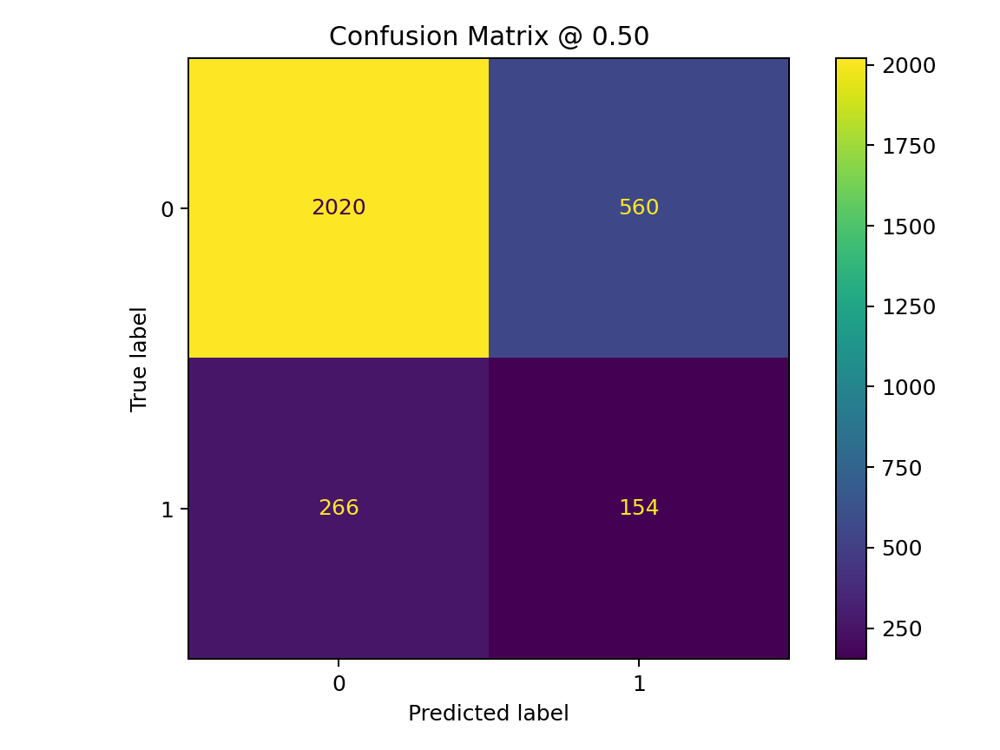
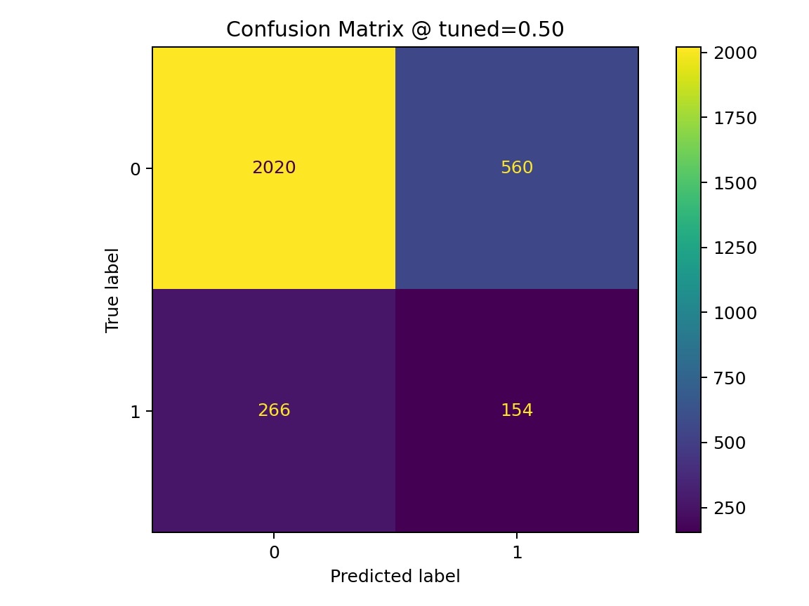

# Predictive Risk Modeling for Patient Readmission

Predict 30-day hospital readmission risk at discharge using routinely available data.  
The project includes a training pipeline, a real-time FastAPI service, evaluation artifacts (ROC/PR, confusion matrices), and explainability (feature importances). It’s ready for demos and dashboards (batch scoring to CSV).

---

## Project Goal & Success Criteria

**Goals**
- Estimate **readmission risk within 30 days** at discharge.
- Expose **real-time scoring** via a REST API with Swagger docs.
- Produce **explainability** and **evaluation** artifacts.
- Enable **batch scoring** for BI tools (Power BI / Tableau).

**Success criteria**
- ROC–AUC ≥ ~0.60 on a held-out test set.
- `/predict` returns probability + label.
- Curves (ROC/PR), confusion matrices, and feature importance saved.
- Batch scoring CSV produced for analytics.

---

## What I Observed

- **Class imbalance:** positives ≈ **14%** on the test split → prioritize **recall/PR** over accuracy alone.
- **Baseline performance (threshold = 0.50):**
  - ROC–AUC: **0.636**
  - PR–AUC: **0.239**
  - F1: **0.272**
  - Accuracy: **0.725**
- **Top drivers** (feature importances): prior admissions (1y), length of stay, discharge to SNF, chronic conditions (diabetes/HF/CKD), age, medication adherence score — aligns with clinical intuition.
- **Operational readiness:** artifacts saved; API online with `/health` and `/docs`; CSV scoring available.

---

## Results

**Model:** XGBoost with scikit-learn preprocessing.  
**Artifacts:** saved in `artifacts/` (images copied to `docs/img/` for GitHub rendering).

### Test Metrics (baseline @ threshold = 0.50)

- ROC–AUC: **0.636**
- PR–AUC: **0.239**
- F1: **0.272**
- Accuracy: **0.725**

| Class | Precision | Recall | F1   | Support |
|------:|----------:|------:|-----:|--------:|
| 0     | 0.884     | 0.783 | 0.830| 2580    |
| 1     | 0.216     | 0.367 | 0.272| 420     |

### Curves & Explainability
  
  
  
  


---

## Architecture

- **Data & Features:** demographics, prior admissions, chronic conditions, length of stay, vitals/labs, discharge disposition, medication adherence.
- **Pipeline:** scikit-learn `ColumnTransformer` (impute, scale, one-hot) → XGBoost classifier.
- **Serving:** FastAPI + Uvicorn with `/predict` and `/health`.
- **Explainability:** model feature importances (SHAP-free for Windows friendliness).
- **Evaluation:** ROC/PR curves, confusion matrices, `metrics.json`.
- **Batch scoring:** CSV output for BI.

---

## Usage

```bash
# 1) Train (writes artifacts/*.pkl)
python src/train.py

# 2) Generate figures (ROC/PR/CM + feature importances)
python src/report_metrics.py
python src/explain_alt.py

# 3) Serve the API
uvicorn serve:app --app-dir src --host 127.0.0.1 --port 8000 --reload
# open http://127.0.0.1:8000/health  -> {"status":"ok"}
# open http://127.0.0.1:8000/docs    -> Swagger UI

# 4) Example request (POST /predict)
# {
#   "age": 76, "sex": "F", "length_of_stay": 4.0, "prior_admissions_1y": 2,
#   "chronic_diabetes": 1, "chronic_hf": 0, "chronic_ckd": 1,
#   "num_medications": 9, "med_adherence_score": 0.62,
#   "avg_systolic_bp": 132.0, "avg_glucose": 118.0,
#   "discharge_to": "snf", "insurance_type": "medicare"
# }

# 5) Batch scoring (for BI/analytics)
python src/score_csv.py   # writes artifacts/risk_scores.csv
